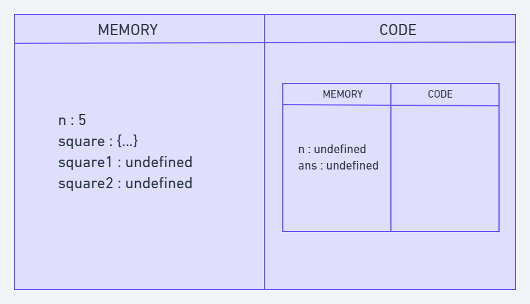
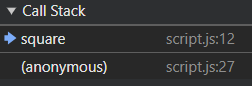

### ``JavaScript Basics``

#### ``Execution Context``
- Everything in Js happens inside an ``Execution Context``.
- When Js engine sees a script files, it creates execution context which handles transformation and execution of code.
- During execution context runtime, variables and functions get allocated with memory and their code get executed.
- Types
1. ``Global EC``
- When script file runs, represents global scope and creates global this and window in browser.

2. ``Function EC``
- Created whenever function get called.

- Two phases
1. ``Creation phase (Memory)``
- Creates global object this and window in browsers.
- Allocates memory and value for variables as undefined and for functions as references like key-value pairs.

2. ``Execution phase (Code/Thread of execution)``
- Reads code line by line and assigns the values of variables.
- For function call, creates a function context and returns value to the main execution context from where function call is invoked.

eg.
```js
var n = 5;

function square(n) {
  var ans = n * n;
  return ans;
}

var square1 = square(n);
var square2 = square(8);  

console.log(square1)
console.log(square2)

```

``Global EC Memory``
```
n: undefined
square: {...}
square1: undefined
square2: undefined
```

``Global EC Code``
```
n: 5
square: {...} 
square1: undefined  // creates Function EC1 and returns value
square2: undefined  // creates Function EC2 and returns value
```

``Function EC1 Memory`` for ``square(5)``
```
n: undefined
ans: undefined
```

``Function EC1 Code``
```
n: 5  // function scope
ans: 25  // value returned back to square(5) in global EC 
```

``Function EC2 Memory`` for ``square(8)``
```
n: undefined
ans: undefined
```

``Function EC2 Code``
```
n: 8  // function scope
ans: 64  // value returned back to square(8) in global EC 
```

``Final Global EC Code``
```
n: 5
square: {...} 
square1: 25
square2: 64
```

``Global EC for variable or function call``


``Local EC fo variable inside function``


``Total flow``



#### Note
- For ``let, const, objects, arrays``, it shows ``uninitialized or not available, in Temporal Dead Zone(variable is inaccessible until initialized with value)``

- ``JavaScript is a synchronous single-threaded language.``

### Call Stack
- To manage the order of execution of execution contexts.
- Has Global context at start of execution then pushes function context whenever function is invoked and after completion of function popped back.
- Follows LIFO principle.

