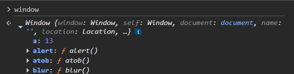
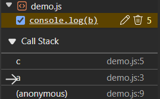
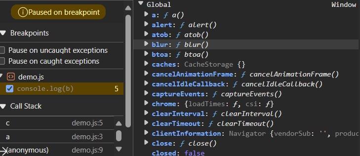
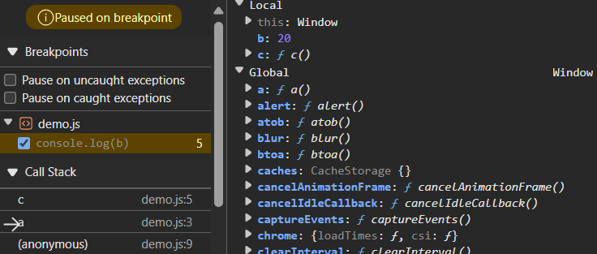
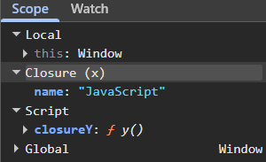
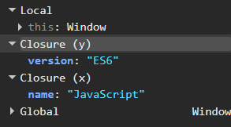

## Datatypes in Js

### `Bad practice`
```js
a = 12;  // not a good practice

console.log(a);
console.log(typeof a);  // number
```

### `Hoisting`
- Moving declarations of variables and functions to the top of code before compilation phase before code gets executed.
- Moves declaration not initialization.
- `var` variables are hoisted and initialized to undefined.
- `let` and `const` are hoisted but reside in TDZ until its declaration made, preventing access before initialization.
- With `functions`, both function name and body get hoisted if we didn't write function expression.
```js
// function hoisting with name and body
// function f1(){
//     return 2;
// }

console.log(f1())  // 2

function f1(){
    return 2;
}
```

```js
pqr()

function pqr(){
    console.log('Hoisting with function statement')  // will work
}

var pqr = function (){
    console.log('Hoisting with function expression')  // error: can't access pqr before initialization
}
```

```js
// var b;
function myFunc(){
    console.log(b)  // prints 10
}
var b = 10; // b is being hoisted
// b = 10; 
myFunc()
```

### `Temporal Dead Zone`
- Time from starting scope till the line where variable is declared and initialized.

### 1.`var`
- ES5 feature, should not be used.
- Can be redeclared and reassigned.
```js
// var declaration and initialization
var a = 12;  // global scoped as js engine converts whole code as function
var a = 13;

a = 16; // reassigned
```
- Function scoped.
```js
// function scoped
function f1(){
    if(true){
        var a = 10;
    }
    console.log(a); // still can access a=10
}

f1();
console.log(a) // can't access a
```
- Temporal Dead Zone
```js
// hoisting
// var a = undefined
console.log(a)  // undefined
console.log(a * 4)  // NaN

var a = 12;
```
- Added in window.



- Leaks memory.
```js
if(true){
    var a = 10;
    let b = 20;
}
console.log(a) // 10
console.log(b) // reference error
```

### 2. `let`
- ES6 feature.
- Can't be redeclared but can be reassigned.
```js
// let declaration and initialization
let a = 12;
// let a = 13;  // error: can't redeclare

a = 16; // reassigned
```
- Block (braces) scoped.
```js
function f1(){
    if(true){
        let a = 10;
        console.log(a);  // 10
    }
    let a = 20;
    console.log(a); // 20
}

f1();
console.log(a) // error: not defined
```
- Temporal Dead Zone
```js
// Temporal Dead Zone + Hoisting
// let b = undefined; // let is hoisted but not initialized, can't access until initialization

console.log(a)  // error: a is not defined
console.log(b) // error: can't access b before initialization (as its in TDZ)

// till this b will have TDZ
let b = 12;
```

### 3. `const`
- ES6 feature.
- Can't be redeclared and reassigned.
```js
// const declaration and initialization
const a;  // not allowed
a = 16;

const b = 12;
const b = 16; // error: can't redeclare & reassign
```
- Block (braces) scoped.
```js
const a = 20;
function f1(){
    const a = 10;
    console.log(a);  // 10
}
console.log(a); // 20
f1();
```
- Temporal Dead Zone
```js
// Temporal Dead Zone + Hoisting
// const b = undefined; // const is hoisted but not initialized, can't access until initialization

console.log(a)  // error: a is not defined
console.log(b) // error: can't access b before initialization (as its in TDZ)

// till this b will have TDZ
const b = 12;
```

### `Note`
- Const allows to change object properties.
```js
const person = { name: 'krushna' }
person.name = 'krish' // allowed to change contents but not the reference (address like pointing to something else)
console.log(person)
person = {} // but can't reassign
```
- Solution
```js
const people = { name: 'arjun' }
Object.freeze(people); // will prevent any modification
people.name = 'parth' // not give error
console.log(people) // { name: 'arjun' }
```

### `Datatypes`

### 1. `Primitive`
- Data types which can be copied as separate and real value.

#### a. `String`
```js
let name = "John"
let surname = 'John'
let username = `John`
```

#### b. `Number`
```js
let num1 = 12
let num2 = -99
let num3 = 12.4
```

#### c. `Boolean`
```js
let val1 = true
let val2 = false
```

#### d. `Null`
- Data type which has absence of value.
```js
let val = null
```

#### e. `Undefined`
- Data type with no assigned value (default).
```js
let val // undefined
```

#### f. `Symbol`
- A unique immutable data type.
- Used to not override keys of any libraries that you're extending.
```js
let u1 = Symbol('uid')
let u2 = Symbol('uid')

console.log(u1 === u2) // false

let obj = {
    uid: 1,
    name: 'Raj',
    rollNo: 24
};

let newUid = Symbol('uid');  // uid is description(name added in object) and newUid is Symbol

newUid.description = "newDescUid"; // doesn't work
obj[newUid] = "007"; // adding newUid in object as secret key with value 007
console.log(obj); // {uid: 1, name: 'Raj', rollNo: 24, Symbol(uid): '007'}
obj[newUid] = "009" // value can be changed 

newUid = Symbol('new description'); // creates new
obj[newUid] = "description value"

console.log(obj); // {uid: 1, name: 'Raj', rollNo: 24, Symbol(uid): '009', Symbol(new description): "description value"}
console.log(Object.keys(obj));  // ['uid', 'name', 'rollNo']
```

#### g. `BigInt`
- To store value more than MAX_SAFE_INTEGER and let number work properly with precision like adding some number to it.
```js
let number = 9007199254740991 // MAX_SAFE_INTEGER
console.log(number + 2)  // error in precision 9007199254740992

let num = 9007199254740991n;  // bigint type 
// console.log(num + 2);  // error can't mix other type with BigInt
console.log(num + 2n); // 9007199254740993
```

### 2. `Reference`
- Data types which can be copied as reference not as real value.

#### a. `Arrays`
```js
const firstArr = [1,2,3];
const secondArr = firstArr;
console.log(secondArr)  // [1,2,3]

secondArr[2] = 4;
console.log(firstArr) // [1,2,4]
```

#### b. `Objects`
```js
const firstObj = {
    "name": "Sundar"
}

const secondObj = firstObj;
console.log(secondObj) // {name: 'Sundar'}

secondObj.name = "Sundari"
console.log(firstObj) // {name: 'Sundari'}
```

## `Dynamic Typing`
- JavaScript is dynamic typed language.
- Defining type of variable at runtime based on what value it contains.
```js
let z = 10;
console.log(z, typeof z) // 10 number
z = true
console.log(z, typeof z) // true boolean
z = "string"
console.log(z, typeof z) // string string
z = []
console.log(z, typeof z) // [] object
```
### `Note`
- typeof `Null` is `object`
- typeof `NaN` is `Number`

## `Type Coercion`
- Automatic conversion of value of data type into another during operations.
```js
// Implicit Coercion - If any of the operand is string and operator is '+' then Js will concatenate
console.log("5" + 1);
console.log(1 + "5");
console.log("5" - 1); // here "5" will be converted into 5 because '-' operator does only subtraction thing

console.log('5' == 5,
    false == 0,  // true → false is coerced to number 0
    true == 1,   // true → true is coerced to number 1
    '' == 0,     // true → empty string is coerced to number 0
    null == false,
    undefined == false)

// Explicit Coercion
console.log(Number("5") + 1); // 6
console.log(String(1) + "5"); // 15
```

## `Type Coercion Rules`
### 1. Coercion always tries to convert to Number, String, Boolean or Primitive.
### 2. Priorites
```js
Arithmetic(+,-) -> Number(unless with string)
Comparison(==) -> Number or Primitive
if, while, !, ? => Boolean
Object to primitive -> String or Number
```
```js
// convert ![] first because of higher precedence of !
console.log([] == ![])  // [] is true, !true(![]) is false
// now conversion of first param[] into primitive, [] == false -> "" == false -> 0 == false -> true
```

### `Note`
- `!!` is logical NOT operator, first it converts any value to its boolean equivalent and then negates it and then again negates it.
```js
console.log(!0) // converts 0(falsy) into truthy value - true
console.log(!!0) // converts first to truthy value and then negates it to falsy value - false
```
- NaN has typeof as Number because its a failed mathematical calculation which is always going to be categorized as Number.
```js
console.log(0/0)
console.log(2 * "Hello")
```

## `Truthy vs Falsy Values`
### 1. `Falsy values` - when used in comparison context
- 0, -0, 0n, false, null, undefined, NaN, "", document.all

### 2. `Truthy values`
- [], {}, 12, 'name'

### `Note`
- Comparing falsy values with false doesn't mean they're same, they're only considered as false when used in boolean context like in `if` condition.
```js
// falsy == false
console.log(null == false)  // false - type coercion not possible
console.log(undefined == false)  // false - type coercion not possible
console.log([] == false) // true - type coercion
console.log(-0 == false) // true - type coercison
console.log("" == false) // true - type coercison

// truthy == true
console.log("hello" == true) // false, "hello" -> into number -> but can't -> NaN == true(1)
console.log({} == true)  // false, {} -> into string -> "[object Object]" -> into number -> NaN == true(1)
console.log([] == true)  // false, [] -> into string -> "" -> into number -> 0 == 1
```

### `Loose and Strict Equality`
### 1. `Loose Equality`
- Compares values after type coercion if needed.
- Types doesn't matter.
```js
'1' == 1        // true (string → number)
true == 1       // true (true → 1)
false == 0      // true (false → 0)
null == undefined // true (special case)
0 == ''         // true ('' → 0)
'0' == false    // true ('0' → 0, false → 0)

let string1 = "name";

// will create String object - String {'name'}
// 0: "n"
// 1: "a"
// 2: "m"
// 3: "e"
let string2 = new String('name');

console.log(string1 == string2)
console.log(string1 === string2)  // false

console.log(typeof string1); // string
console.log(typeof string2); // object
```
- Exception `undefined == null` returns `true`.

### 2. `Strict Equality`
- Compares both value and type.
- No type coercion.
```js
1 === 1         // true
'1' === 1       // false (string !== number)
true === 1      // false (boolean !== number)
null === undefined // false
```

## `Undefined vs Null`
### 1. `Undefined`
- Automatically assigned by Js when
#### a. When a variable is declared but not initialized.
#### b. When a function does not explicitly return a value.
#### c. When accessing non-existent property of an object or an array.
```js
let x;
console.log(x) // undefined

function base(){
    console.log('In a base')
    // return 2;
}

function func(){
    let value;
    console.log(value)   // undefined
    console.log(base())  // doesn't get returned value - undefined
}
func()

let object = {}
console.log(obj.property) // undefined

let arr = []
console.log(arr[2])  // undefined
```

### 2. `Null`
- Null value is explicitly given by developer.
- Represents absence of value or reset a variable.
```js
let y = null;
console.log(y); // null
let obj = { property: null };
console.log(obj.property); // null
```

### `Note`
- `typeof []` returns `object`.
- `typeof function f(){}` returns 'function`.
- To find real type of any array or function we use `instanceof`.
- `instanceof` only works with `reference` type not with `primitive` type.
```js
// variable instanceof Class
console.log(f1 instanceof Function) // true
console.log(arr instanceof Array) // true

console.log(12 instanceof Number)  // false
console.log("name" instanceof String)  // false
console.log(true instanceof Boolean)  // false
console.log(Symbol('a') instanceof Symbol)  // false
console.log(10000000000000000000000n instanceof BigInt)  // false
```

## `Functions`
### 1. `Anonymous Functions`
- Function expression without any name.
```js
// func is name of function but function expression doesn't have any name
let func = function(){
    console.log('Func called');
}
func();
```

### `Note`
- Function expression is a function assigned to a variable, passed as argument to another function and closure.
```js
// assigned to variable
const greet = function() {
    console.log("Hello!");
};
greet();

// passed as an argument
setTimeout(function() {
    console.log("Timer done");
}, 1000);
```

### 2. `Arrow Functions`
- Simpler function expression without writing any function keyword, return keyword and the curly braces.
```js
let myFunction = (a, b) => a * b;
console.log(myFunction(2, 3));

let hello = () => "Hello World!";
console.log(hello())

let val1 = () =>{
    console.log('Arrow function called');
}     
val1();
```
```js
// will not work as we're not returning any value
let f2 = (x, y) => { x * y } ;  // considers {} as function body, not an expression to return 
console.log(f2(2, 4))  // undefined

// will not work
let f3 = (x, y) => return x * y ;  // return will not work w/o curly braces

// right code as we're explicitly returning value
let f3 = (x, y) => { return x * y };  // or x * y will also work
console.log(f3(3, 4))
```

### 3. `Default Params`
```js
function add(v1, v2) {
    console.log(v1 + v2)
}
add() // NaN
add(2) // NaN

function sub(v1, v2 = 1) {  // default parameter
    console.log(v1 - v2)
}
sub() // NaN
sub(2) // 1
```

### 4. `Rest Operator`
- Converts number of elements into single array or object.
- Works in function parameters if it has a lot of parameters.

```js
// rest operator
function abcd(...val){
    console.log(val)  // [1, 2, 3, 4, 5, 6, 7]
}
abcd(1,2,3,4,5,6,7);

const myObj = {
    id: 1,
    name: 'Falak',
    rollNo: 24,
    class: 'X'
}
const {id, name, ...other} = myObj;
console.log(other);  // {rollNo: 24, class: 'X'}
```

### 5. `First Order Functions`
- Treating functions as values.
- Assigning to variables, pass as arguments and return from other functions.
```js
// first order functions
function xyz(val){
    val();
}   

xyz(function (){
    console.log('First order functions')
})

// treating function as value storing into a variable
let ans = function sum(a, b){
    return a + b;
}
ans(2, 6)
```
```js
function shout(msg){
    return msg;
}

function processing(fun){
    console.log(fun('HELLO'))
}

processing(shout)
```

### 6. `Higher Order Functions`
- Functions that either returns another function or takes another function in parameter.
```js
// Taking another function as parameter - xyz is hof
function xyz(val){
    val();
}   

xyz(function (){
    console.log('Higher order functions')
})

// Returning another function
function hof(){
    return function(){
        console.log('Higher order functions')
    }
}

hof()();  // for calling inner function
```

### 7. `Pure and Impure Functions`
- Functions that change outside variables called as impure and who don't called as pure functions.
```js
// pure and impure functions
let variable = 5;

// pure function
function pure(){
    console.log(variable)
}
pure()

// impure function
function impure(){
    variable++;
    console.log(variable)
}
impure()
```

### 8. IIFE


## `Lexical Scope`
- It is the context in which variables and functions are accesssible.
- Uses the location where variable is declared within the source code to determine where that variable is available.
- Nested functions have access to variables declared in their outer scope.

#### `Types`
1. `Global Scope`
- Variables declared outside the function, accessed everywhere in the code.

2. `Local Scope`
- Variables (var, let and const) written inside any function can be accessed in that function or block only.

## `Lexical Environment`
- It is a mechanism to manage and access the variables based on the local scope.
- It containes local memory variables plus lexical environment of its parent.
- Whenever execution context is created so is lexical environment.
- Execution context contains all local scope variables and functions plus reference to its parent lexical environment execution context.
- The reference to the parent lexical environment is created during the Memory (Creation) phase of an Execution Context.

```js
function a(){
    let b = 20
    c()
    function c(){
        console.log(b)  // prints 20
    }
}

a()
```

### BTS -
``Global EC Memory``
```
a: {...}  // function references
outer LE ref: null (No top-level)
```

``Function EC Memory - a()``
```
b: uninitialized
c: {...} 
outer LE ref: Global 
```

``Function EC Memory - c()``
```
(no local variables)
outer LE ref: a()
```

``Global EC Code``
```
a()
```

``Function EC Code - a()``
```
b: 20
c()
```

``Function EC Code - c()``
```
console.log(b)
```



`Global` - 



`Parent Lexical Env - a()`



`Local - c()`


## `Scope Chain`
- Scope chain is chain of looking variables first in local current lexical environment and then moving to outer lexical environment until it founds or throws a ReferenceError.
- For above eg.
c() LE (tries to find b but doesn't get it) -> a() LE (tries to find b and gets it else would have gone to Global EC) -> Global -> null

## `Closures`
- A closure is created when a function remembers the variables from its lexical scope, even after that outer function has finished executing so keeping variables alive of outer scope.

- Simply, function bundled with its lexical scope.

- When you write a function inside another function, like y inside x, and y uses variables from x, y forms a closure.

- Function returning another function which uses variables of parent function.

- Closure contains 
1. the function itself
2. lexical environment(scope) with all the variables from parent scopes that the function actually uses


```js
// here closure is being created for y which contains function y and keeps a reference to variable from its outer scope (closed over name)
function x(){
    var name = "JavaScript"
    function y(){
        console.log(name)
    }
    return y;
}

// closureY = function y + reference to its lexical scope (name = "JavaScript")
const closureY = x()  
closureY()  // "JavaScript"
```

- Closure scope, here y is the function with the closure and closure includes the environment (x) which contains name.


### Note
- If the inner function doesn’t use a variable from the outer scope, that variable is not part of the closure.

- Closures can be nested.

```js
function x(){
    // closure for y = y() + name
    var name = "JavaScript"
    var version = "ES6" // will not be contained in closure of y 'cause its never been used in function y
    function y(){
        // closure for z = z() + greeting + name
        var greeting = "Hello"
        function z(){
            console.log(greeting+ " " + name);
        }
        return z;
    }
    return y;
}

const closureY = x();   // closureY => f y(){...body}
const closureZ = closureY();  // closureZ = f z(){...body}
closureZ();
```

```js
function x(){
    var name = "JavaScript"
    function y(){
        var version = "ES6"
        console.log(name)
        function z(){
            console.log(name + " " + version)
        }
        z()
    }
    y()
}

x()
```

Here, closure of function z includes z() + closure of function y (y() + name)



- Closure captures the actual variable not its value means it just references to variable, doesn't freeze its value, instead it looks for live value.
```js
function x(){
    var a = 7;
    function y(){
        console.log(a)  // 10
    }
    a = 10 // value of a will be updated to 10
    y()
}

x()
```

- Closure works similar with let and const as it works with var just let and const have better scoping rules.
```js
// with let
function x(){
    if(true){
        let a = 7;
    }
    function y(){
        console.log(a) // reference error
    }
    y()
}

x()


// with const
function x(){
    {
        const a = 7;
    }
    function y(){
        console.log(a) // reference error
    }
    y()
}

x()
```

- Use cases
1. `Currying`
- A technique in which a function takes multiple arguments and then transform into a sequence of funtions, each taking a single argument.
```js
const e = 10;
function sum(a) {
    // closure
    return function (b) {
        // closure
        return function (c) {
            // closure
            return function (d) {
                // local scope
                return a + b + c + d + e;
            };
        };
    };
}

console.log(sum(1)(2)(3)(4)); // 20

// with arrow function
const add = a => b => a + b;
console.log(add(5)(3));
```

2. `Memoize`
- An optimization technique that stores the results of expensive calculation avoiding calculating again if same inputs are provided.
```js
function slowSquare(n){
    console.log('Calculating..')
    return n * n;
}

function memoize(func){
    const cache = {};

    // function closed over cache
    return function(arg){
        if(arg in cache){
            console.log('Calculated already!')
            return cache[arg];
        }

        const result = func(arg);
        cache[arg] = result;
        return result;
    }
}

const memoizeFunc = memoize(slowSquare);
console.log(memoizeFunc(2));
console.log(memoizeFunc(2));
console.log(memoizeFunc(4));
console.log(memoizeFunc(4));
```

### `Closure with SetTimout (var and let)`
```js
function x() {
    // here function inside setTimeout forms closure which references i not its value 
    // so as loop finishes instantly now i has value as 6
    for (var i = 1; i <= 5; i++) {
        setTimeout(function () {
            console.log(i); // and then will print 6 five times
        }, i * 1000);
    }
    console.log("Closure with SetTimeout!")  // will run this first
}

x()
```

- var is function scoped (not block scoped) which shares i variable across all iterations of the loop.

```js
// solution with let
function x() {
    for (let i = 1; i <= 5; i++) {
        setTimeout(function () {
            console.log(i);
        }, i * 1000);
    }
    console.log("Closure with SetTimeout!")  
}

x()
```
- let is block scoped which creates a new one each timeas its gets a new scope each time and closures capture that new i in each iteration.
- BTS
```js
// Not actual syntax, but conceptually:
for (let _i = 0; _i < 3; _i++) {
  let i = _i; // create a new `i` for this iteration
  // body uses this `i`
}
```

```js
// solution with var
function x() {
    for (var i = 1; i <= 5; i++) {
        // function param j will create a new variable each time
        function closedOver(j) {
            // function below forms closure and closed over j
            setTimeout(function () {
                console.log(j);
            }, j * 1000);
        }
        closedOver(i)
    }
    console.log("Closure with SetTimeout!")
}

x()
```

```js
// solution with IIFE + var
function x() {
    for (var i = 1; i <= 5; i++) {
        // here IIFE creates a fresh copy of j
        // function closed over j
        (function (j) {
            setTimeout(function () {
                console.log(j);
            }, j * 1000)
        })(i)
    }
    console.log("Closure with SetTimeout!")
}

x()
```

// Need to learn closures with this, closures in asynchronous code

## `IIFE`
- Its a function that runs as soon as its defined.
- Its one shot execution can't be reused. 
```js
// function expression
(function() {
  console.log("I am an IIFE!");
})();

// IIFE as arrow function
(() => {
    console.log('IIFE');
})();

// IIFE as async function
(async function () {
    console.log('IIFE');
})();

var result = (function (a, b){
    return a + b;
})(2, 3)
console.log(result)

// function statements/declaration doesn't work as IIFE
function() {
  console.log("I am an IIFE!");
}();
```

- Use cases
1. `Prevent global variable pollution - Private scope (Encapsulation)`
2. `Safe scope for variables`
3. `Works with closure`
```js
var counter = (function() {
    // private variable - safe scope
    var count = 0;

    // IIFE returns an object with public methods
    return {
        // closure
        increment: function() {
            count++;
        },
        // closure
        decrement: function() {
            count--;
        },
        // closure
        getCount: function() {
            return count;
        }
    };
})();

counter.increment();
counter.increment();
counter.decrement();

console.log(counter.getCount()); 

// Trying to access the private count variable directly
console.log(counter.count); // undefined (cannot access private variable)
```
- Run once and protect internals but normal functions can be created multiple times.
- Can't create a new instance as its called immediately.

```js
// another variant of IIFE
// + and ! forces js to treat function declaration as expression to run as IIFE
+function(){ console.log("hi") }(); // same as (function(){ console.log("hi") })();
!function(){ console.log("bye") }(); // same as (function(){ console.log("bye") })();
```

