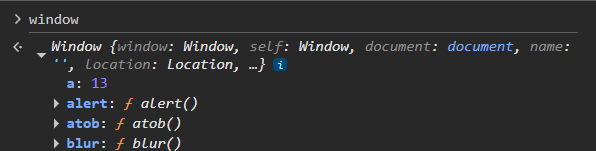

## Datatypes in Js

### ``Bad practice``
```js
a = 12;  // not a good practice

console.log(a);
console.log(typeof a);  // number
```

### ``Hoisting``
- Moving declarations of variables and functions to the top of code before compilation phase before code gets executed.
- Moves declaration not initialization.
- ``var`` variables are hoisted and initialized to undefined.
- ``let`` and ``const`` are hoisted but reside in TDZ until its declaration made, preventing access before initialization.
- With ``functions``, both function name and body get hoisted.
```js
// function hoisting with name and body
// f1 = function() {
//     return 2;
// };

console.log(f1())  // 2

function f1(){
    return 2;
}
```

### ``Temporal Dead Zone``
- Time from starting scope till the line where variable is declared and initialized.

### 1.``var``
- ES5 feature, should not be used.
- Can be redeclared and reassigned.
```js
// var declaration and initialization
var a = 12;  // global scoped as js engine converts whole code as function
var a = 13;

a = 16; // reassigned
```
- Function scoped.
```js
// function scoped
function f1(){
    if(true){
        var a = 10;
    }
    console.log(a); // still can access a=10
}

f1();
console.log(a) // can't access a
```
- Temporal Dead Zone
```js
// hoisting
// var a = undefined
console.log(a)  // undefined
console.log(a * 4)  // NaN

var a = 12;
// a = 12
```
- Added in window.



- Leaks memory.
```js
if(true){
    var a = 10;
    let b = 20;
}
console.log(a) // 10
console.log(b) // reference error
```

### 2. ``let``
- ES6 feature.
- Can't be redeclared but can be reassigned.
```js
// let declaration and initialization
let a = 12;
// let a = 13;  // error: can't redeclare

a = 16; // reassigned
```
- Block (braces) scoped.
```js
function f1(){
    if(true){
        let a = 10;
        console.log(a);  // 10
    }
    let a = 20;
    console.log(a); // 20
}

f1();
console.log(a) // error: not defined
```
- Temporal Dead Zone
```js
// Temporal Dead Zone + Hoisting
// let b = undefined; // let is hoisted but not initialized, can't access until initialization

console.log(a)  // error: a is not defined
console.log(b) // error: can't access b before initialization (as its in TDZ)

// till this b will have TDZ
let b = 12;
```

### 3. ``const``
- ES6 feature.
- Can't be redeclared and reassigned.
```js
// const declaration and initialization
const a;  // not allowed
a = 16;

const b = 12;
const b = 16; // error: can't redeclare & reassign
```
- Temporal Dead Zone
```js
// Temporal Dead Zone + Hoisting
// const b = undefined; // const is hoisted but not initialized, can't access until initialization

console.log(a)  // error: a is not defined
console.log(b) // error: can't access b before initialization (as its in TDZ)

// till this b will have TDZ
const b = 12;
```

### ``Note``: 
- Const allows to change object properties.
```js
const person = { name: 'krushna' }
person.name = 'krish' // allowed to change contents but not the reference (address like pointing to something else)
console.log(person)
person = {} // but can't reassign
```
- Solution
```js
const people = { name: 'arjun' }
Object.freeze(people); // will prevent any modification
people.name = 'parth' // not give error
console.log(people) // { name: 'arjun' }
```
